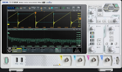
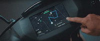
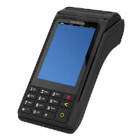
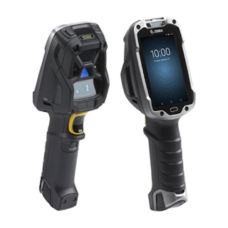
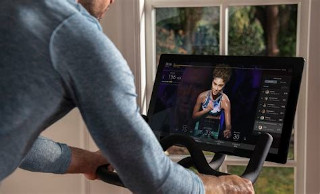
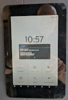

# Android in the wild

Google support and promote Android in five main categories of device: Phone,
Tablet, TV, Automotive and Wearable. In most cases, these devices come bundled
with access to Google services, including Play Store, search, push
notifications and more. There are three packages to cover the types of device:
Google Mobile Services (GMS), Google TV Services (GTVS) and Google Automotive
Services (GAS).  You have to license them from Google, which means that you
have to go through a lengthy validation procedure and you have to pay a
(usually) per-device fee

However, that is only part of the story. The open source nature of AOSP means
that it is common for manufacturers to build Android into devices of all kinds.
We call this **Embedded Android**, i.e. Android embedded inside a device.
Each device is different, but they generally share some or all of these
characteristics:

* custom hardware
* custom port of AOSP
* run a single app, without the ability for an end user to install apps from an app store (\*)
* do not license Google services (GMS, GTVS, GAS)
* may not have passed the Compatibility Test Suit (CTS) (and so should not
  mention Android in marketing or on the device)

(\*) some may have their own limited app store

To give you some idea of the breadth of devices running Embedded Android, the
sections below give some representative examples. If you know of others and you
would like me to add them to this gallery, please email me at chris@2net.co.uk

## Test and measurement
### Rigol DHO 1000 oscilloscope

[https://www.rigol.eu/products/oscillosopes/DHO1000%20series.html](https://www.rigol.eu/products/oscillosopes/DHO1000%20series.html)

## Bikes and scooters
### Aether Energy 450X scooter

## Point of Sale
### Verifone

### Zebra (Symbol) TC8300 Touch Computer

## Exercise machines
### Peloton

## Building and room access
### Jung door entry panel

